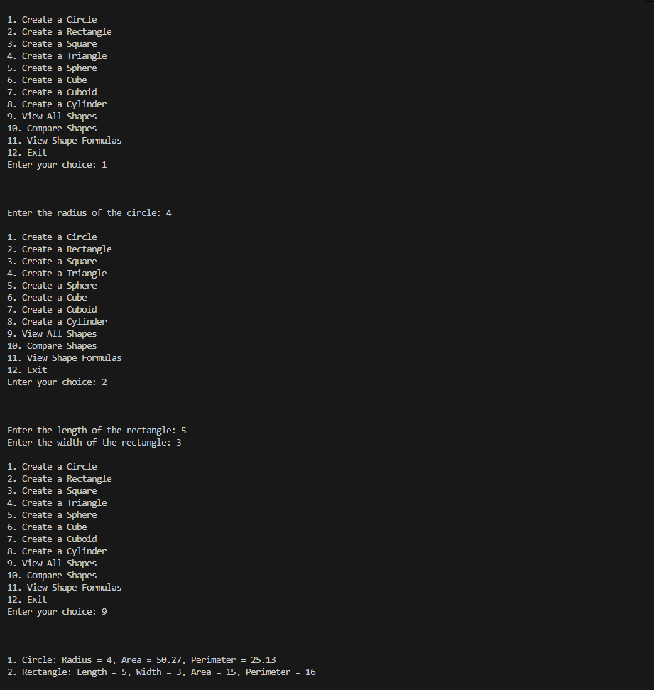

# Geometrical Calculator

## Things this will acomplish
* Allows you to create shapes
* Find different measurments
* Compare data and more!

## Setup
There is little to no setup and it will walk you through the process of the program.

## Example program
